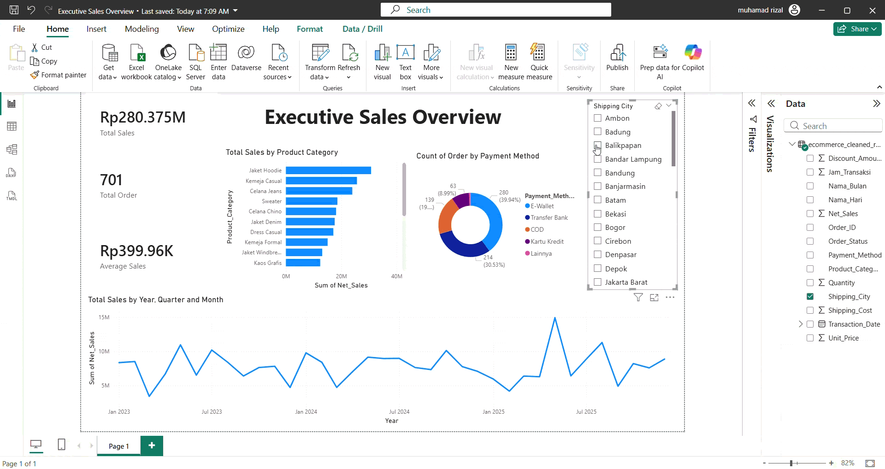

# 📊 Analisis Performa E-Commerce dan Profitabilitas Penjualan Apparel (2023-2025)



## 👤 Informasi
- **Nama:** Muhamad Rizal
- **Repo:** https://github.com/rizalizul/ecommerce-apparel-data-analysis
- **Dashboard PBIX:** Tersedia pada file `analisis_data_ecom_apparel.ipynb`

---

# 1. 🎯 Ringkasan Proyek
Proyek ini bertujuan untuk menganalisis efisiensi operasional dan profitabilitas bisnis retail pakaian (apparel) secara online. Data transaksi mentah dibersihkan menggunakan Python (Pandas) dengan mengimplementasikan algoritma **Fuzzy Matching** untuk memperbaiki ribuan kesalahan pengetikan nama kota secara otomatis. Hasil data bersih kemudian divisualisasikan menjadi *dashboard* interaktif menggunakan **Microsoft Power BI** untuk membantu manajemen dalam pengambilan keputusan strategis.

---

# 2. 📄 Problem & Goals
**Problem Statements:** - Data mentah transaksi *e-commerce* memiliki banyak anomali, seperti nilai harga yang minus, data diskon yang kosong, dan kesalahan pengetikan nama kota pengiriman yang masif.
- Pemilik bisnis kesulitan melihat gambaran besar mengenai kategori pakaian apa yang paling menguntungkan dan seberapa besar kerugian akibat pesanan yang dibatalkan/diretur.
  
**Goals:** - Melakukan *Data Preparation* dan *Cleaning* menggunakan Python untuk menstandardisasi data.
- Menghitung metrik finansial seperti *Net Sales* dan *Average Order Value (AOV)*.
- Membangun *dashboard* interaktif yang memonitor tren penjualan harian, performa produk, dan efisiensi metode pembayaran.

---

## 📁 Struktur Folder
```text
ecommerce-apparel-data-analysis/
│
├── .venv/
├── data/                
│   ├── indonesia_ecommerce_apparel_2023_2025.csv (Mentah)
│   └── ecommerce_cleaned_ready.csv (Bersih)
│
├── images/  
│   ├── Dashboard.png
│   └── dashboard_demo.gif
│
├── analisis_data_ecom_apparel.ipynb
├── generate_indonesia_ecommerce_dataset.py
├── Executive Sales Overview.pbix
├── requirements.txt
└── README.md
```

# 3. 📊 Dataset
- **Konteks:** Data transaksi e-commerce di Indonesia untuk kategori fashion/apparel. 
- **Rentang Waktu:** 2023 - 2025
- **Jumlah Data:** 50.000 baris transaksi.
- **Tipe:** Tabular CSV

## 📌 Fitur Utama Dataset
| Nama Kolom            | Deskripsi                                                         |
|----------------------|-------------------------------------------------------------------|
| Order_ID             | ID unik transaksi (contoh: ORD-2023-00001) |
| Transaction_Date	   | Tanggal dan waktu pesanan dibuat |
| Product_Category	   | Jenis pakaian (contoh: Kaos Polos, Celana Chino, Jaket Denim) |
| Unit_Price	       | Harga satuan barang dalam Rupiah |
| Quantity             | Jumlah kuantitas barang yang dibeli |
| Discount_Amount	   | Potongan harga dari voucher |
| Payment_Method	   | Metode pembayaran (COD, E-Wallet, Kartu Kredit, Transfer Bank) |
| Shipping_City        | Kota tujuan pengiriman barang di Indonesia |
| Order_Status	       | Status penyelesaian transaksi (Completed, Cancelled, Returned) |

---

# 4. 🔧 Data Preparation & Cleaning (Python Pandas)
- **Format Tipe Data:** Mengonversi string waktu ke format kalender datetime64.
- **Handling Missing Values:** Mengisi NaN pada diskon dengan 0 dan melabeli metode pembayaran yang kosong dengan "Lainnya".
- **Logika Angka:** Menghilangkan anomali angka minus (negatif) menggunakan operasi absolut .abs().
- **Advanced Text Cleaning:** Menggunakan algoritma Levenshtein Distance lewat library thefuzz untuk melakukan Fuzzy Matching (>80% similarity threshold). Proses ini otomatis memperbaiki puluhan variasi typo (misal: "Bandun", "JakartaUtara") menjadi format data master yang baku.
- **Feature Engineering:** Membuat kolom baru Net_Sales untuk menghitung pendapatan bersih sesungguhnya per baris transaksi.

---

# 5. 💡 Business Insights (Temuan Utama)
1. Metode Pembayaran & Retur: Pembelian menggunakan metode COD menyumbang angka pesanan Cancelled/Returned tertinggi, mengindikasikan beban operasional ongkos kirim yang terbuang sia-sia.
2. Produk Bintang: Kategori Jaket Denim memiliki margin paling sehat, menghasilkan Net Sales tertinggi di berbagai kota besar.
3. Puncak Transaksi: Lonjakan penjualan selalu terjadi pada jam malam, menunjukkan perilaku belanja yang sangat dipengaruhi oleh waktu luang pekerja.

---

# 6. 🎯 Rekomendasi Aksi Bisnis
- **Evaluasi Metode COD:** Memberikan ekstra ongkos kirim atau memperketat syarat minimum pembelian khusus untuk metode COD guna menekan cancellation rate.
- **Optimalisasi Stok:** Fokus memproduksi atau menyetok ulang Jaket Hoodie menjelang musim liburan atau payday sale.

---

# 7. 🚀 Cara Menjalankan Proyek
Panduan berikut menjelaskan cara menjalankan script analisis data ini secara lokal.

## Clone Repository

```bash
git clone https://github.com/rizalizul/ecommerce-apparel-data-analysis.git
cd ecommerce-apparel-data-analysis
```

## Install Dependencies
Pastikan Python sudah terinstal, lalu jalankan:
```bash
pip install -r requirements.txt
```

## Menjalankan Script Pembersihan Data
Gunakan Visual Studio Code dengan ekstensi Jupyter untuk membuka file notebook:
```bash
analisis_data_ecom_apparel.ipynb
```
Pilih "Run All" untuk melihat proses pembersihan dan pengeksporan file CSV bersih.

## Membuka Dashboard
Buka file Executive Sales Dashboard.pbix menggunakan aplikasi Microsoft Power BI Desktop (khusus OS Windows).